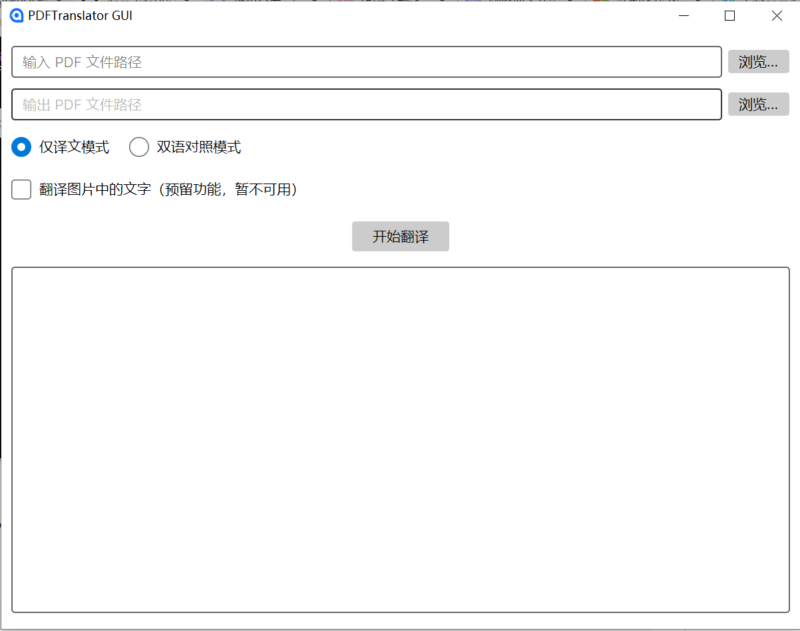

# PDFTranslator

📄 **PDFTranslator** 是一款基于 [Ollama](https://ollama.ai/) 的本地 PDF 翻译工具，提供图形界面（GUI）和命令行界面（CLI），支持双语对照和仅译文两种翻译模式，并尽可能保持原始 PDF 的排版（包括文本、图像和图形）。

## 目录结构
```bash
PDFTranslator/
├── PDFTranslator.sln                           # 解决方案文件，包含三个项目：Core、CLI、GUI
├── PDFTranslator.Core/                          # 核心类库项目，封装所有业务逻辑和PDF处理
│   ├── PDFTranslator.Core.csproj                # 项目文件，定义依赖包和目标框架
│   ├── TranslationOptions.cs                    # 翻译配置选项（模型、模式、字体设置）
│   ├── OllamaService.cs                         # Ollama API 客户端，负责调用本地模型进行翻译
│   ├── FontHelper.cs                            # 字体辅助类，提供多级字体加载和回退机制（含嵌入字体）
│   ├── PdfTranslator.cs                         # PDF翻译核心逻辑：文本提取、位置分析、译文绘制
│   └── Fonts/                                    # 存放嵌入的字体文件（如 NotoSansSC-Regular.ttf）
│       └── NotoSansSC-Regular.ttf                # 内置中文字体，确保中文正确显示
├── PDFTranslator.CLI/                           # 命令行界面项目
│   ├── PDFTranslator.CLI.csproj                  # 项目文件，引用Core项目
│   └── Program.cs                                # CLI入口，解析命令行参数并调用翻译服务
├── PDFTranslator.GUI/                           # 图形界面项目（基于Avalonia UI）
│   ├── PDFTranslator.GUI.csproj                  # 项目文件，包含Avalonia相关包引用
│   ├── Program.cs                                # GUI入口，启动Avalonia应用程序
│   ├── App.axaml                                 # 应用级别的XAML资源（样式、主题等）
│   ├── App.axaml.cs                              # 应用后台代码，配置依赖注入和主窗口
│   ├── ViewModels/                               # 视图模型层（MVVM）
│   │   ├── ViewModelBase.cs                       # 视图模型基类（继承ReactiveObject）
│   │   └── MainWindowViewModel.cs                  # 主窗口视图模型，处理用户交互和进度显示
│   ├── Views/                                     # 视图层（XAML界面）
│   │   ├── MainWindow.axaml                        # 主窗口界面布局
│   │   └── MainWindow.axaml.cs                     # 主窗口后台代码（事件处理等）
│   └── Assets/                                     # 资源文件夹（图标、图片等）
│       └── avalonia-logo.ico                        # 应用程序图标
├── README.md                                      # 项目说明文档（功能、安装、使用）
├── LICENSE                                        # 许可证文件（AGPL-3.0）
└── .gitignore                                     # Git忽略文件（bin、obj等）
```

## ✨ 主要功能

## ✨ 主要功能

- **🖥️ 双界面支持**：提供跨平台的图形用户界面（基于 Avalonia UI）和功能完备的命令行工具，满足不同用户习惯与自动化需求。

- **🌐 本地翻译引擎**：通过 [Ollama](https://ollama.ai/) 调用本地大语言模型（如 `llama3.2`、`qwen2.5` 等），所有翻译均在本地完成，无需联网，确保文档隐私安全。

- **📄 两种翻译模式**：
  - **双语对照**：保留原始文本，在原文下方添加蓝色半透明译文，便于对比学习和审校。
  - **仅译文**：用白色矩形覆盖原文，并在相同位置绘制黑色译文，实现纯净的译文文档（适合背景为白色的 PDF）。

- **🖼️ 保留原始排版**：精确提取 PDF 中每个文本块的位置信息，译文严格按照原文坐标绘制，尽力保持原文档的布局、字体大小和样式。

- **🔤 智能字体处理**：
  - 支持用户指定系统字体名称（如 `SimSun`、`Microsoft YaHei`）。
  - 支持直接加载外部字体文件（`.ttf`、`.ttc`、`.otf`）。
  - **内置字体回退**：程序内嵌了开源的 Noto Sans SC 中文字体，当系统无合适字体时自动使用，确保中文正确显示，告别方框乱码。

- **📊 实时进度反馈**：
  - **GUI** 提供可视化进度条和详细的日志区域，实时显示当前处理页数和状态信息。
  - **CLI** 支持动态控制台进度条，并可选择禁用，适合脚本集成。

- **⚙️ 灵活配置**：
  - 可自定义 Ollama 服务地址、模型名称和请求超时时间。
  - 支持从环境变量 `OLLAMA_HOST` 和 `OLLAMA_MODEL` 读取默认配置。
  - GUI 中提供连接测试和模型下拉列表，一键刷新可用模型。

- **📦 开源免费**：基于 AGPL-3.0 许可证发布，所有依赖库均为开源组件，欢迎社区贡献与二次开发。

> 📸 **GUI 预览**  
>  

## 🚀 快速开始

### 系统要求

- [.NET 10 SDK](https://dotnet.microsoft.com/download/dotnet/10.0)（或 .NET 8/9 兼容版本）
- [Ollama](https://ollama.ai/) 已安装并运行（默认地址 `http://localhost:11434`）
- 至少一个翻译模型（例如 `llama3.2`：`ollama pull llama3.2`）

### 下载与编译

```bash
git clone https://github.com/dom-kital/PDF_Translator.git
cd PDFTranslator
dotnet restore
dotnet build
```

### 运行 GUI 版本
```bash
dotnet run --project PDFTranslator.GUI
```
### 运行 CLI 版本
```bash
dotnet run --project PDFTranslator.CLI -- <输入PDF> <输出PDF> [选项]
```
#### 示例
```bash
# 仅译文模式
dotnet run --project PDFTranslator.CLI -- input.pdf output.pdf

# 双语对照模式，使用模型 qwen2.5
dotnet run --project PDFTranslator.CLI -- input.pdf output.pdf --mode bilingual --model qwen2.5
```
#### 命令行选项
| 选项  |说明   |
| ------------ | ------------ |
| - -mode, -m <模式>  | 翻译模式：translate（仅译文）或 bilingual（双语对照），默认 translate  |
|  --model <模型名> | Ollama 模型名称，默认 llama3.2  |
| --translate-images, -ti <true/false>  | 是否翻译图片中的文字（预留，暂未实现），默认 false  |
|  --help, -h |  显示帮助信息 |

## 🔤 字体设置指南

PDFTranslator 提供了灵活的字体配置选项，确保译文能够正确显示中文等非拉丁字符。以下是在 GUI 和 CLI 中设置字体的详细说明。

### 📍 字体加载优先级

程序按以下顺序尝试加载字体，直到成功为止：

1. **用户指定的字体文件路径**（最高优先级）
2. **用户指定的字体名称**（系统已安装的字体）
3. **自动检测系统常用中文字体**（根据操作系统自动选择，如 Windows 的 `SimSun`、macOS 的 `PingFang SC`、Linux 的 `Noto Sans CJK SC`）
4. **程序内嵌的开源字体**（Noto Sans SC，确保中文始终可显示）
5. **iText 默认字体**（不支持中文，显示为方框，仅作最终回退）

---

### 🖥️ GUI 中设置字体

在图形界面中，您可以通过以下两种方式指定字体：

#### 方式一：指定字体名称
- 在 **“字体名称”** 输入框中直接输入系统已安装的字体名称，例如：
  - Windows：`SimSun`（宋体）、`Microsoft YaHei`（微软雅黑）、`KaiTi`（楷体）
  - macOS：`PingFang SC`（苹方）、`STHeiti`（黑体）
  - Linux：`Noto Sans CJK SC`、`WenQuanYi Zen Hei`

#### 方式二：指定字体文件
- 点击 **“浏览”** 按钮，选择本地字体文件（支持 `.ttf`、`.ttc`、`.otf` 格式）。选择后，程序将优先使用该文件中的字体。

> 💡 **提示**：如果两种方式都未提供，程序将自动检测系统字体，若检测失败则使用内置字体。您无需任何设置即可获得中文支持。

---

### ⌨️ CLI 中设置字体

命令行版本提供两个参数用于字体配置：

| 参数 | 说明 | 示例 |
|------|------|------|
| `--font-name <名称>` | 指定系统已安装的字体名称 | `--font-name SimSun` |
| `--font-path <路径>` | 指定字体文件的完整路径 | `--font-path "C:\Windows\Fonts\simsun.ttc"` |

#### 使用示例

```bash
# 使用系统字体名称
dotnet run --project PDFTranslator.CLI -- input.pdf output.pdf --font-name "Microsoft YaHei"

# 使用字体文件
dotnet run --project PDFTranslator.CLI -- input.pdf output.pdf --font-path "/usr/share/fonts/noto/NotoSansCJK-Regular.ttc"

# 同时指定名称和文件（文件优先级更高）
dotnet run --project PDFTranslator.CLI -- input.pdf output.pdf --font-name SimSun --font-path ./myfont.ttf
```
### 📦程序内嵌字体说明
程序默认内嵌了 Noto Sans SC 开源中文字体（SIL Open Font License）。当系统字体不可用时，此字体将作为最终保障，确保译文中的中文正确显示。内嵌字体位于 PDFTranslator.Core/Fonts/ 目录，您可以根据需要替换或添加其他字体。
### 如需自定义内嵌字体
## 📦 内嵌字体说明

程序默认内嵌了 **Noto Sans SC** 开源中文字体（SIL Open Font License）。当系统字体不可用时，此字体将作为最终保障，确保译文中的中文正确显示。内嵌字体位于 `PDFTranslator.Core/Fonts/` 目录，您可以根据需要替换或添加其他字体。

### 如何自定义内嵌字体

1. **准备字体文件**：下载您喜欢的开源中文字体文件（支持 `.ttf` 或 `.otf` 格式），例如思源黑体、文泉驿等。
2. **放置文件**：将字体文件放入 `PDFTranslator.Core/Fonts/` 文件夹中。
3. **修改项目文件**：编辑 `PDFTranslator.Core.csproj`，确保字体文件被设置为嵌入资源。添加以下内容：
   ```xml
   <ItemGroup>
     <EmbeddedResource Include="Fonts\YourFont.ttf" />
   </ItemGroup>
4. **更新字体加载逻辑**：打开`FontHelper.cs`，找到 `_embeddedFontResources` 数组，将您的字体资源名称添加到列表中（例如 `"PDFTranslator.Core.Fonts.YourFont.ttf"`）。程序将按顺序尝试加载这些嵌入字体。
5. **重新编译**：运行 dotnet build 使更改生效。

---
### 缺点
- ~~字体支持：默认字体不支持中文，需手动配置中文字体（已实现）。~~
- 仅译文模式的背景：目前用白色矩形覆盖原文，若原 PDF 背景非白色，会留下白色块。后续可考虑提取背景色或使用半透明覆盖。
- ~~图片翻译：尚未实现图片文字识别与翻译，精度不高已放弃~~
- 文本块合并：当前每个文本块（可能为单词或字符）单独翻译，可能导致上下文割裂，后续版本将优化为按行或段落合并翻译。